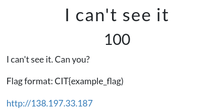
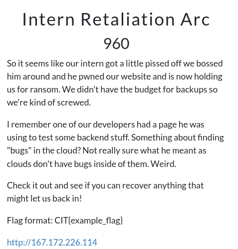
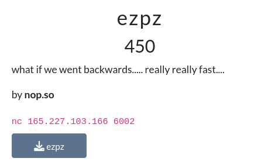
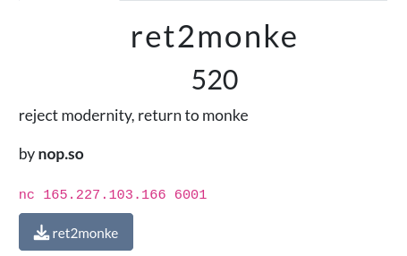
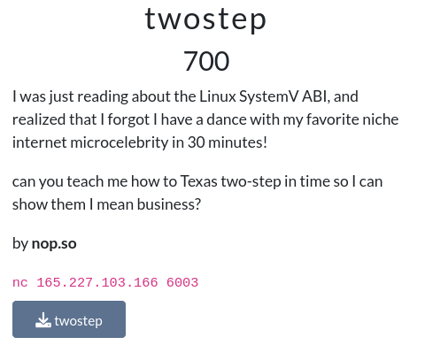

| Category |     Challenge Name     | Description                          | Technique                                                         | Writeup      |
| :------: | :--------------------: | ------------------------------------ | ----------------------------------------------------------------- | ------------ |
|   Web    |     I cant see it      |    | Cookie decrypt                                                    | [Solution](https://github.com/Jeetu855/CTFs/blob/master/CITCTF2024/Web/Solution.md) |
|   Web    | Intern Retaliation Arc |  | parameter fuzz                                                    | [Solution](https://github.com/Jeetu855/CTFs/blob/master/CITCTF2024/Web/Solution.md#intern-retaliation-arc) |
|   Pwn    |          ezpz          |  | buffer overflow + variable tampering                              | [Solution](https://github.com/Jeetu855/CTFs/blob/master/CITCTF2024/Pwn/ezpz/Solution.md) |
|   Pwn    |   really really old    |  | buffer overflow + shellcode injection                             | [Solution](https://github.com/Jeetu855/CTFs/blob/master/CITCTF2024/Pwn/reallyreallyold/Solution.md) |
|   Pwn    |       ret2monke        |  | buffer overflow + return to win                                   | [Solution](https://github.com/Jeetu855/CTFs/blob/master/CITCTF2024/Pwn/ret2monke/Solution.md) |
|   Pwn    |        twostep         |  | buffer overflow + stack data leak + return to win with parameters | [Solution](https://github.com/Jeetu855/CTFs/blob/master/CITCTF2024/Pwn/twostep/Solution.md) |
