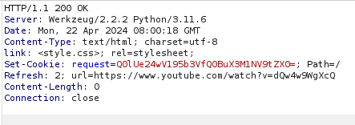
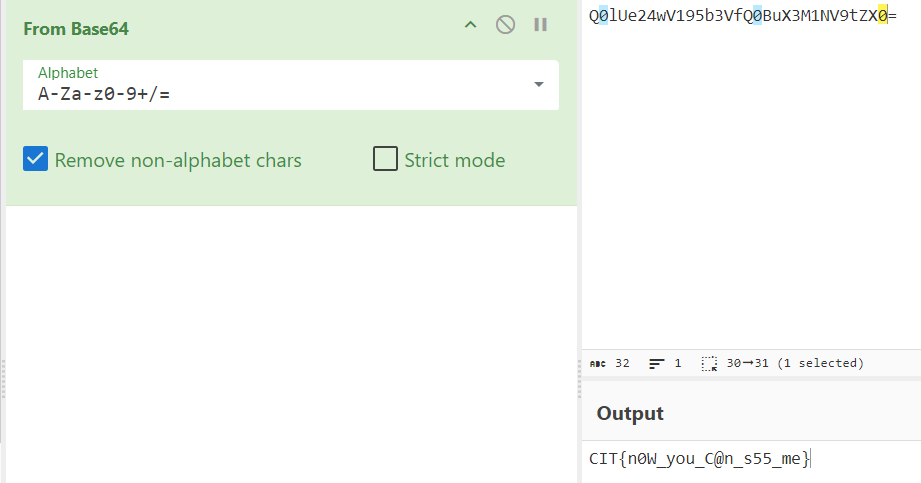
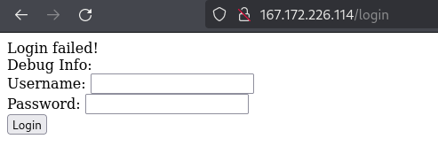
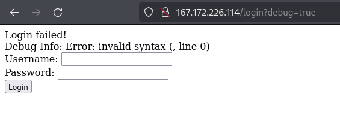
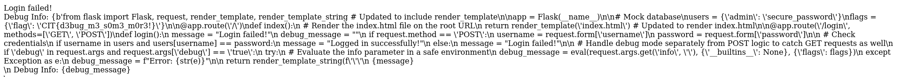

### I can’t see it - Web

Go to the webpage, keep intercept on because the page automatically sends us to youtube because the server sets http header `Refresh`



We take a look at the cookie and it looks like base64 encoding, lets try to decrypt it



**_flag : CIT{n0W_you_C@n_s55_me}_**

---

### Intern Retaliation Arc

(I was not able to solve this one, this is solution from my understading after reading a writeup)
On main webpage nothing interesting, the description tells use some kind of backdoor, so lets fuzz

We find `/login` directory



We can sql injection since there is only one functionality of login form, but there is no sql injection

It says `Debug Info` so how does it know, maybe a hidden parameter



It says invalid syntax, maybe there is another parameter as well, lets fuzz for it and we will find `info` param

The sever running on python flask, we can get that from wapalyzer
It is some kind of pyjail

```url
http://167.172.226.114/login?debug=true&info={''.__class__.__mro__[1].__subclasses__()[107].load_module("subprocess").check_output(["cat","app.py"])}
```



And we get the flag
**_flag : CIT{d3bug_m3_s0m3_m0r3!}_**Attachments/
