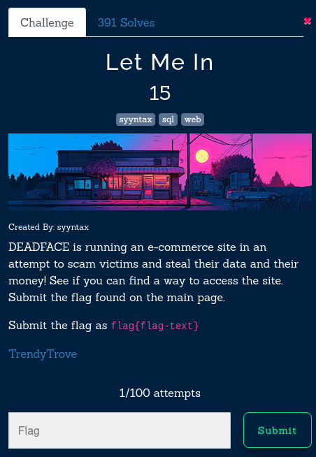

#### Let Me In 



We are greeted with a login page, first thing that I try is basic SQL injection, given that this question has lots of solves and 
is of less points, it must be something easy only


payload 
```text
a' or 1=1#
```
And we get the flag 


```sh
flag : flag{Tr3ndy_Tr0v3_$QL_1nj3ct10n}
```