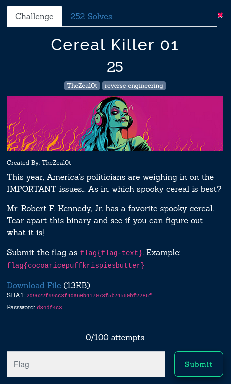

#### Cereal-killer 01 



Running the binary with ltrace we are prompted for imput, just type something random, I typed "lmao"

```scss
strlen("lmao")                                                                     = 4
isspace(111, ...)                                                                   = 0
isspace(108, ...)                                                                   = 0
memmove(0xffa12a1c, "lmao\0", 5)                                                   = 0xffa12a1c
islower(108, ...)                                                                    = 512
islower(109, ...)                                                                    = 512
islower(97, ...)                                                                     = 512
islower(111, ...)                                                                    = 512
strncmp("yznb", "obboreel", 8)                                                       = 1
puts("ACCESS DENIED!!!")                                                            = 17
```

- The program uses memmove to copy "lmao" into a buffer.
- Password Comparison: Transformed Input: "yznb"
The transformation from "lmao" to "yznb" suggests the use of the rot13 cipher

```scss 
o	b
b	o
b	o
o	b
r	e
e	r
e	r
l	y
```

Run the binary and type --> booberry

```sh 
flag : flag{The-M0st-Fam0us-Nephew-Loves-B00B3rry!}
```

