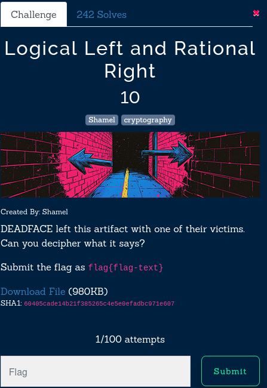
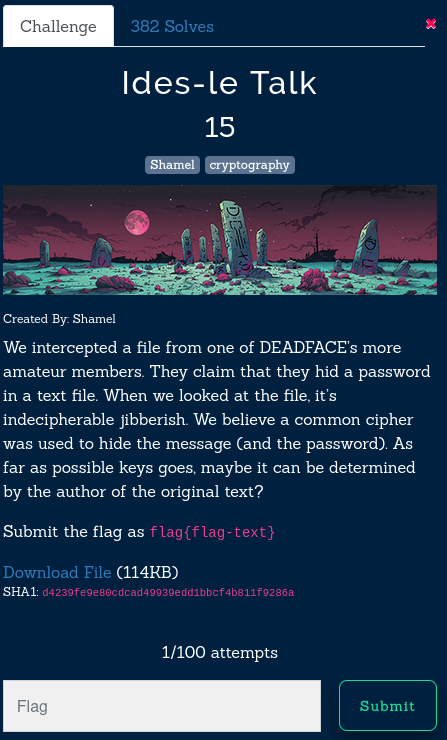
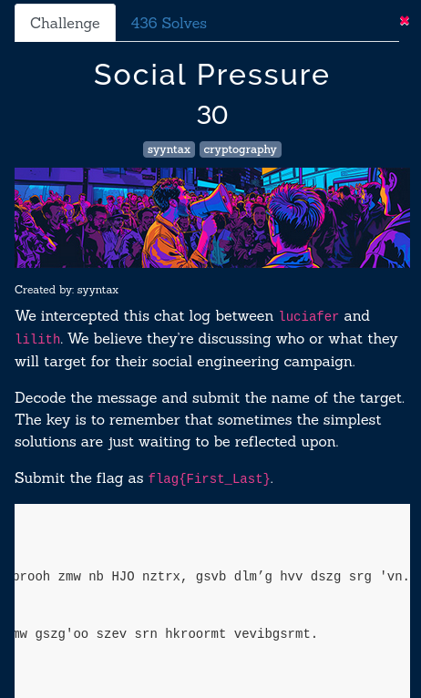
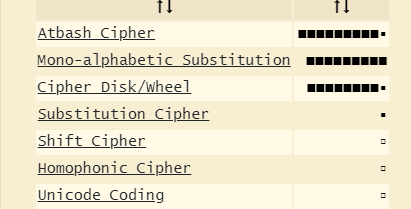

#### Logical Left and Rational



Given :
```text
\/\\/\/\ \///\/\/ \///\\// \///\/\\ \\/\\\\\ \//\\\\/ \\/\\\\\ \//\//\\ \//\/\\/ \///\/\\ \///\/\\ \//\//\\ \//\\/\/ \\/\\\\\ \///\\// \//\//// \//\//\/ \//\\/\/ \///\/\\ \//\/\\\ \//\/\\/ \//\///\ \//\\/// \\/\\\\\ \///\/\\ \//\//// \\/\\\\\ \//\\/// \//\\/\/ \///\/\\ \\/\\\\\ \///\\// \///\/\\ \//\\\\/ \///\\/\ \///\/\\ \//\\/\/ \//\\/\\ \\/\//\\ \\/\\\\\ \//\/\\\ \//\//// \///\\\\ \//\\/\/ \\/\\\\\ \////\\/ \//\//// \///\/\/ \\/\\\\\ \//\/\\\ \//\\\\/ \///\//\ \//\\/\/ \\/\\\\\ \//\\//\ \///\/\/ \//\///\ \\/\\\\\ \///\/\\ \//\/\\\ \//\/\\/ \///\\// \\/\\\\\ \////\\/ \//\\/\/ \//\\\\/ \///\\/\ \\/\\\\\ \/\/\/\\ \///\/\/ \///\\/\ \//\\\/\ \//\//// \\/\\\\\ \/\/\/\\ \//\\\\/ \//\\\// \//\/\// \////\\/ \\/\\\\/ \\/\\\\/ \\/\\\\/ \\/\\\\/ \\/\\\\\ \//\\//\ \//\//\\ \//\\\\/ \//\\/// \////\// \/\\/\\\ \\//\\// \/\//\\/ \/\//\\/ \\//\\\\ \/\/\/\/ \///\\/\ \/\\\//\ \\//\\\/ \/\\///\ \\//\/\\ \\//\\\/ \\//\\\/ \/\//\\/ \\//\/\\ \/\/\/// \\//\/\\ \/\\/\// \\//\\// \/////\/
```

Set of forward slashes and backward slashes, 8 of these are separated by space so maybe they represent binary, I first assumed that 
0 = '\' and 
1 = '/' 
The following code performs the task of decryption

```python
def decode_slash_cipher(encoded_message):
    decoded_message = ""
    for encoded_char in encoded_message.split(" "):
        binary_repr = encoded_char.replace("\\", "0").replace("/", "1")
        decoded_message += chr(int(binary_repr, 2))
    return decoded_message


cipher_with_spaces = r"\/\\/\/\ \///\/\/ \///\\// \///\/\\ \\/\\\\\ \//\\\\/ \\/\\\\\ \//\//\\ \//\/\\/ \///\/\\ \///\/\\ \//\//\\ \//\\/\/ \\/\\\\\ \///\\// \//\//// \//\//\/ \//\\/\/ \///\/\\ \//\/\\\ \//\/\\/ \//\///\ \//\\/// \\/\\\\\ \///\/\\ \//\//// \\/\\\\\ \//\\/// \//\\/\/ \///\/\\ \\/\\\\\ \///\\// \///\/\\ \//\\\\/ \///\\/\ \///\/\\ \//\\/\/ \//\\/\\ \\/\//\\ \\/\\\\\ \//\/\\\ \//\//// \///\\\\ \//\\/\/ \\/\\\\\ \////\\/ \//\//// \///\/\/ \\/\\\\\ \//\/\\\ \//\\\\/ \///\//\ \//\\/\/ \\/\\\\\ \//\\//\ \///\/\/ \//\///\ \\/\\\\\ \///\/\\ \//\/\\\ \//\/\\/ \///\\// \\/\\\\\ \////\\/ \//\\/\/ \//\\\\/ \///\\/\ \\/\\\\\ \/\/\/\\ \///\/\/ \///\\/\ \//\\\/\ \//\//// \\/\\\\\ \/\/\/\\ \//\\\\/ \//\\\// \//\/\// \////\\/ \\/\\\\/ \\/\\\\/ \\/\\\\/ \\/\\\\/ \\/\\\\\ \//\\//\ \//\//\\ \//\\\\/ \//\\/// \////\// \/\\/\\\ \\//\\// \/\//\\/ \/\//\\/ \\//\\\\ \/\/\/\/ \///\\/\ \/\\\//\ \\//\\\/ \/\\///\ \\//\/\\ \\//\\\/ \\//\\\/ \/\//\\/ \\//\/\\ \/\/\/// \\//\/\\ \/\\/\// \\//\\// \/////\/"

decoded = decode_slash_cipher(cipher_with_spaces)
print(f"Decoded message: {decoded}")
```
Output : 
```text
Decoded message: Just a little something to get started, hope you have fun this year Turbo Tacky!!!! flag{H3YY0UrF1N411Y4W4K3}
```

```sh
flag : flag{H3YY0UrF1N411Y4W4K3}
```

--- 

#### ides-le talk



Given a large text file, at first glance it looks like `rot` operation so I just tried few common ones like rot13 and got the 
answer on first attempt. They gave us hint in the question that its a very common encryption technique.

rot13 is symmetric cipher: The same operation is used for both encryption and decryption.
rot13 operates by replacing each letter in the plaintext with the letter 13 positions after it in the alphabet. Since the English alphabet has 26 letters, applying rot13 twice brings you back to the original text.


Following script decrypts the give text and also finds the flag in the large file, I saved the data give in a file named 
rot13_encoded.txt

```python
import codecs

def read_and_decode_rot13(filename):
    try:
        with open(filename, "r") as file:
            encrypted_content = file.read()
        decoded_content = codecs.decode(encrypted_content, "rot_13")
        for line in decoded_content.splitlines():
            if "flag" in line:
                print(line)
                break
    except FileNotFoundError:
        print(f"Error: The file '{filename}' does not exist.")


if __name__ == "__main__":
    read_and_decode_rot13("rot13_encoded.txt")
```

```sh
flag : flag {L3t_The#Mi$chiefs^8361n}
```

---

#### Social Pressure 



Given a gibberish text, first things first, anaylyze it using dcode



Atbash cipher, now just have to write a script to decrypt it
Atbash cipher is a Monoalphabetic substitution cipher.
What it does it each letter in the plaintext is replaced by its mirror image in the alphabet. Essentially, the first letter is swapped with the last, the second with the second-last, and so on

```text
Plain Alphabet:  A B C D E F G H I J K L M N O P Q R S T U V W X Y Z
Cipher Alphabet: Z Y X W V U T S R Q P O N M L K J I H G F E D C B A
```

```python
import string

def atbash_decrypt(text):
    upper = string.ascii_uppercase
    lower = string.ascii_lowercase
    reversed_upper = upper[::-1]
    reversed_lower = lower[::-1]
    table_upper = str.maketrans(upper, reversed_upper)
    table_lower = str.maketrans(lower, reversed_lower)
    return text.translate(table_upper).translate(table_lower)

with open('atbash_encoded.txt', 'r', encoding='utf-8') as f:
    encoded = f.read()

decrypted = atbash_decrypt(encoded)
print(decrypted)

```

```sh
flag : flag{Elroy_Ongaro}
```