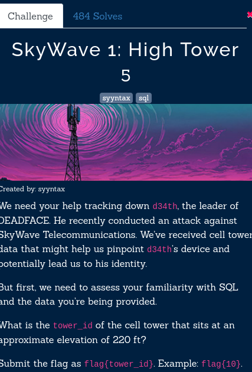
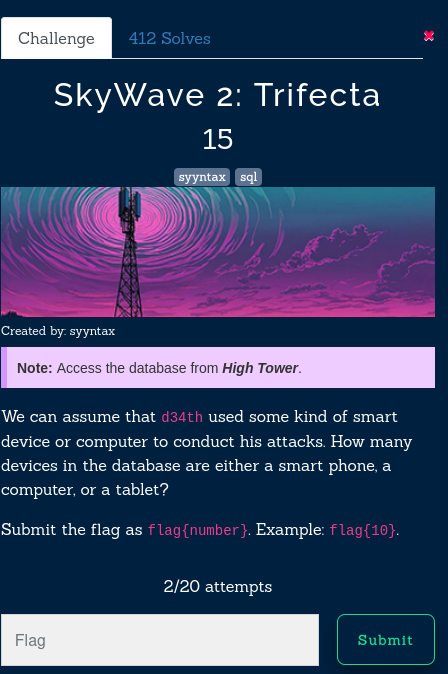
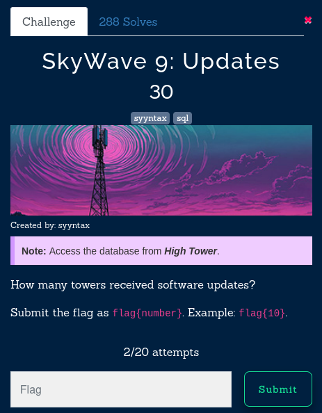
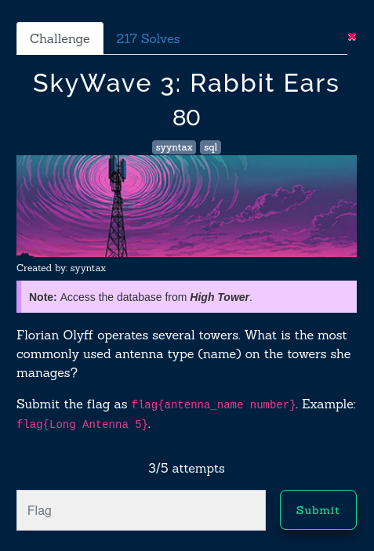
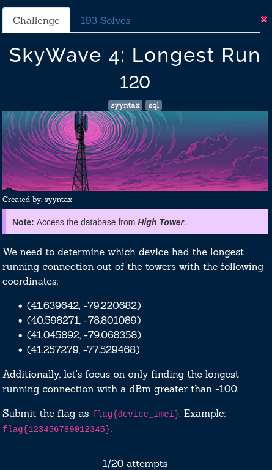
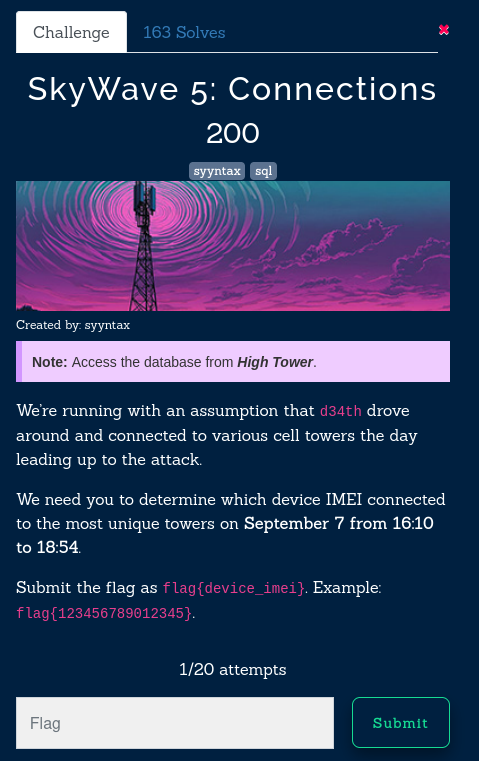

In this series of challenges we had to ssh to a machine where we had to run SQL commands to fetch the required data that the question
demanded. It was good practice of SQL programming 

#### SkyWave 1: High Tower 



```SQL
SELECT tower_id
FROM Towers
ORDER BY ABS(elevation - 220) ASC
LIMIT 1;
```

- SELECT tower_id: Retrieves the tower_id from the Towers table.
- FROM Towers: Specifies the table to query.
- ORDER BY ABS(elevation - 220) ASC: Orders the towers by the absolute difference between their elevation and 220 ft in ascending order. This means the tower with the smallest difference (i.e., closest to 220 ft) appears first.
- LIMIT 1: Restricts the result to only the top record, effectively selecting the tower with the elevation closest to 220 ft.

```sh
flag : flag{215}
```

--- 


#### SkyWave 2: Trifecta  



```SQL
SELECT COUNT(d.device_id) AS total_devices
FROM Devices d
JOIN Device_Types dt ON d.device_type_id = dt.device_type_id
WHERE dt.device_type_name IN ('smartphone', 'computer', 'tablet');
+---------------+
| total_devices |
+---------------+
|           714 |
+---------------+
```

```sh
flag : flag{714}
```

--- 

#### SkyWave 9: Updates 



```SQL
SELECT COUNT(DISTINCT tm.tower_id) AS total_towers_software_updated
FROM Tower_Maintenance tm
WHERE tm.maintenance_type = 'Software updates';
```

```sh
flag : flag{70}
```

--- 

#### SkyWave 3: Rabbit Ears 



```SQL
SELECT
a.antenna_name,
COUNT(*) AS usage_count
FROM
Towers t
JOIN
Tower_Sectors ts ON t.tower_id = ts.tower_id
JOIN
Antennas a ON ts.antenna_id = a.antenna_id
WHERE
t.operator_id = 4
GROUP BY
a.antenna_name
ORDER BY
usage_count DESC;
```

```sh
flag : flag{Multiple Input Multiple Output (MIMO) 3}
```

--- 

#### SkyWave 4: Longest Run



```SQL
SELECT
    d.device_id,
    d.device_imei,
    d.manufacturer,
    d.model,
    SUM(c.connection_duration) AS total_connection_duration_seconds,
    SEC_TO_TIME(SUM(c.connection_duration)) AS total_connection_duration
FROM
    Connections c
JOIN
    Towers t ON c.tower_id = t.tower_id
JOIN
    Devices d ON c.device_id = d.device_id
WHERE
    (
        (t.latitude = 41.639642 AND t.longitude = -79.220682)
        OR (t.latitude = 40.598271 AND t.longitude = -78.801089)
        OR (t.latitude = 41.045892 AND t.longitude = -79.068358)
        OR (t.latitude = 41.257279 AND t.longitude = -77.529468)
    )
    AND c.signal_strength > -100
GROUP BY
    c.device_id
ORDER BY
    total_connection_duration_seconds DESC
LIMIT 1;
```

```sh
flag : flag{845303290931675}
```

#### SkyWave 5: Connections 



```SQL
 SELECT
d.device_imei,
   COUNT(DISTINCT c.tower_id) AS unique_tower_count
FROM
     Connections c
JOIN
     Devices d ON c.device_id = d.device_id
 WHERE
     c.connection_time BETWEEN '2024-09-07 16:10:00' AND '2024-09-07 18:54:00'
0 GROUP BY
     d.device_imei
 ORDER BY
     unique_tower_count DESC

 LIMIT 1;
+-----------------+--------------------+
| device_imei     | unique_tower_count |
+-----------------+--------------------+
| 377494868035375 |                  5 |
+-----------------+--------------------+
```

```sh
flag : flag{5_377494868035375}
```