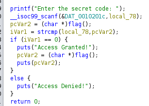
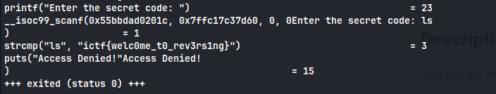

Lets decompile the file and read the it

We can see that it is using string operation to compare our input to the data returned by flag function

Lets run the program using ltrace

And we find the flag

**_flag : ictf{welc0me_t0_rev3rs1ng}_**
