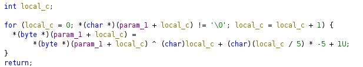
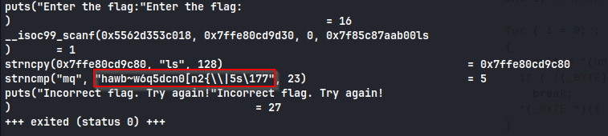

Same as previous one, lets look at the decompiled code



This time we have a mystery function that does some encoding on the flag

lets run the program with ltrace



The operation is : Given text XORed with the index i%5 + 1

Basically checkFlag takes the byte text `hawb~w6q5dcn0[n2{\\|5s\x7f` and pushes it to the mysteryFunction which XORs it with i%5 +1 where i is the current element index.

So we can write a solve script for it

```python
from pwn import *

ct = b'hawb~w6q5dcn0[n2{\\|5s\x7f'

flag = ""

index = 0

for i in ct:
	letter = i ^ (index%5+1)
	index = index + 1
	flag = flag + chr(letter)

print(flag)
```

Run this and we get the **_flag : ictf{v4r1abl3_k3y_x0r}_**
