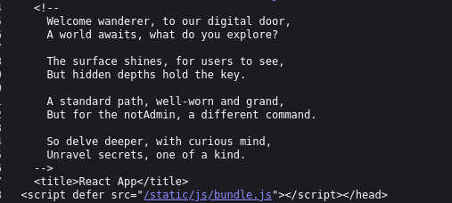
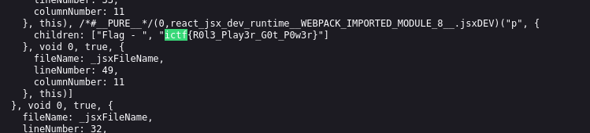

We right click and do `view page source`, in comments its written

Just below the image we have the script for the page, lets look at it
We know that the flag format is `ictf{...}` so lets search for it

**_And we find the flag : ictf{R0l3_Play3r_G0t_P0w3r}_**
