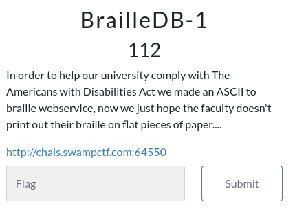
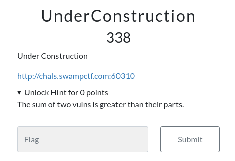
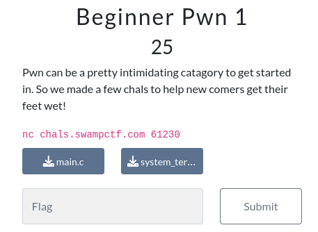
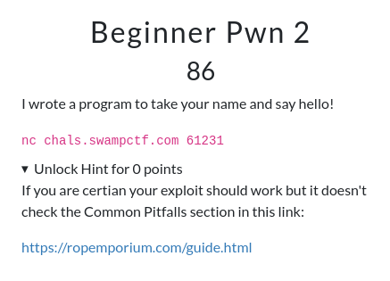

| Category |  Challenge Name   | Description                    | Technique                                   | Writeup                                                                                              |
| :------: | :---------------: | ------------------------------ | ------------------------------------------- | ---------------------------------------------------------------------------------------------------- |
|   Web    |    BrailleDB-1    |  | SQL Injection                               | [Solution](https://github.com/Jeetu855/CTFs/blob/master/SwampCTF/Web/Solutions.md)                   |
|   Web    | UnderConstruction |  | LFI + SQL Injection                         | [Solution](https://github.com/Jeetu855/CTFs/blob/master/SwampCTF/Web/Solutions.md#underconstruction) |
|   Pwn    |  Beginner Pwn 1   |  | Buffer Overflow                             | [Solution](https://github.com/Jeetu855/CTFs/blob/master/SwampCTF/Pwn/Beginner%20Pwn%201/Solution.md) |
|   Pwn    |  Beginner Pwn 2   |  | Return to win 64bit                         | [Solution](https://github.com/Jeetu855/CTFs/blob/master/SwampCTF/Pwn/Beginner%20Pwn%202/Solution.md) |
|   Pwn    |     Guess it      |                                | Format String + Canary Leak + Return to win | [Solution](https://github.com/Jeetu855/CTFs/blob/master/SwampCTF/Pwn/guess_it/exploit.py)            |
|   Web    |  Meme Generator   |                                | SSRF                                        | [Solution](https://github.com/Jeetu855/CTFs/blob/master/SwampCTF/Web/Solutions.md#memegenerator)     |
