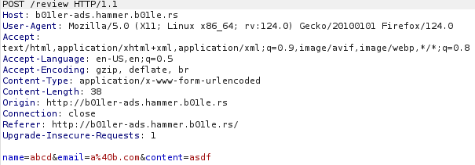
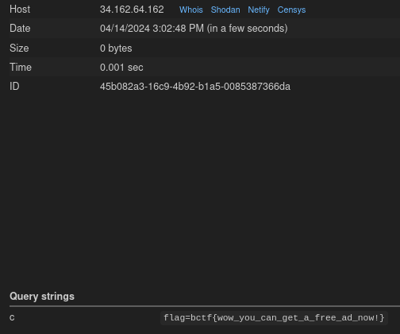

### b01ler-ad

We are greeted with a page having lots of ads and a signup form
We are also given index.js file which is the source code for the web page

When we signup, we see post request being sent to `/review`, Lets take a look at the request



3 parameters : name, email and content

In source code we can see

```js
const content = req.body.content
  .replace("'", "")
  .replace('"', "")
  .replace("`", "");
const urlToVisit = CONFIG.APPURL + "/admin/view/?content=" + content;
```

We can see that the content parameter is being input sanitized
The problem is if we read about replace() in javascript, in only replaces the first instance that it encounters
If we want to replace all instances we need to use replaceAll()

So lets say we enter : ' ' payload'
The output will be 'payload' : the first single quote is being replace by space

req.body.content.replace("'", ''): This will replace the first single quote (') with an empty string. Since the input starts with two single quotes, only the first one will be replaced, leaving the second one untouched. The result will be 'payload'.
.replace('"', ''): This will not find any double quotes (") in the input, so the string remains unchanged: ' aaaaaaa'.
.replace("", ''): This will not find any backticks (` `) in the input, so the string remains unchanged: ' aaaaaaa'.

So we can see from source code, our data is being addes to the url and being viewed by the admin so we can send
an XSS to steal the admin cookie which most likely contains the flag

our payload will look like this

```html

```

We can see that there are 2 quotes before our url and 1 after it because first quote will be replace by space

We can send a curl request like this

```sh
curl http://b01ler-ads.hammer.b01le.rs/review -X "POST" -d "name=aaaa&email=a%40b.com&content="
```

We have to url encode @ in the email parameter while sending it. Send it and check our webhook



and we get the **_flag : bctf{wow_you_can_get_a_free_ad_now!}_**
